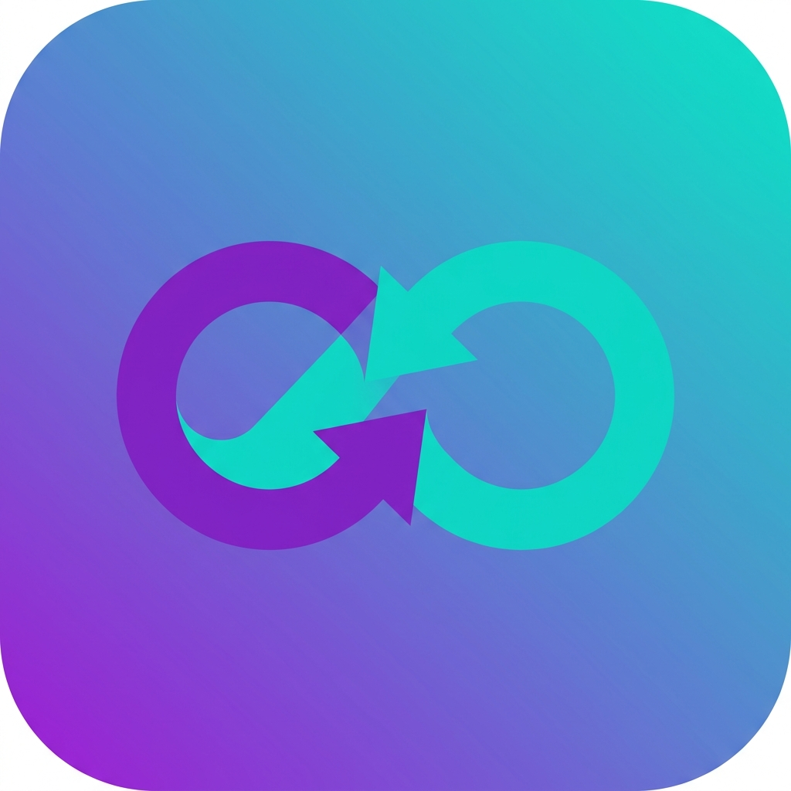

<div align="center">
  
  <h1>Lensify (Scanify)</h1>
  <p><strong>A 100% offline, intelligent, and secure document scanner built with Flutter.</strong></p>
  
  [](https://flutter.dev/)
  [](https://dart.dev/)
  [](https://opensource.org/licenses/MIT)
</div>

---

## 🌟 Overview

**Lensify** is a premium, open-source document scanning application designed to compete with industry giants like CamScanner and Adobe Scan. Built with Clean Architecture principles, it ensures robust performance and maintainability while keeping your data 100% secure and offline on your device.

## ✨ Premium Features

- 📸 **Smart Document Scanning:** Auto-crop and perspective correction for flawless scans.
- 🪪 **ID Card Mode:** Combine front and back sides of ID cards onto a single A4 canvas seamlessly.
- 🔍 **Offline OCR (Optical Character Recognition):** Extract text from scanned documents locally using Google ML Kit without needing an internet connection.
- ✍️ **Signature Studio:** Sign your documents digitally with a smooth, native drawing canvas.
- 🔒 **Biometric Security:** App and folder lock utilizing Face ID / Touch ID (via `local_auth`).
- 📂 **Local Database:** Lightning-fast document management and caching powered by `Isar` Database.
- 🚀 **State Management:** Fully reactive UI managed by `Riverpod`.

## 📸 Screenshots

*(Add your app screenshots here to showcase the beautiful UI!)*

## 🛠️ Tech Stack

- **Framework:** Flutter & Dart
- **State Management:** Riverpod
- **Local Database:** Isar
- **Machine Learning:** Google ML Kit (Text Recognition)
- **Security:** Local Auth (Biometrics)
- **Image Processing:** Image Cropper, Camera, Image

## 🚀 Getting Started

### Prerequisites

- Flutter SDK `^3.0.0`
- Xcode (for iOS build)
- Android Studio (for Android build)

### Installation

1. Clone the repository:
   ```bash
   git clone https://github.com/emreaytekxn/lensify.git
   ```
2. Navigate into the directory:
   ```bash
   cd lensify
   ```
3. Install dependencies:
   ```bash
   flutter pub get
   cd ios && pod install --repo-update && cd ..
   ```
4. Run the app:
   ```bash
   flutter run
   ```

## 👨‍💻 Developer

**Naim Emre Aytekin**
- 🌐 [Website](https://naimemreaytekin.site)
- 🐙 [GitHub](https://github.com/emreaytekxn)

---
<div align="center">
  <i>If you like this project, please consider giving it a ⭐️!</i>
</div>
